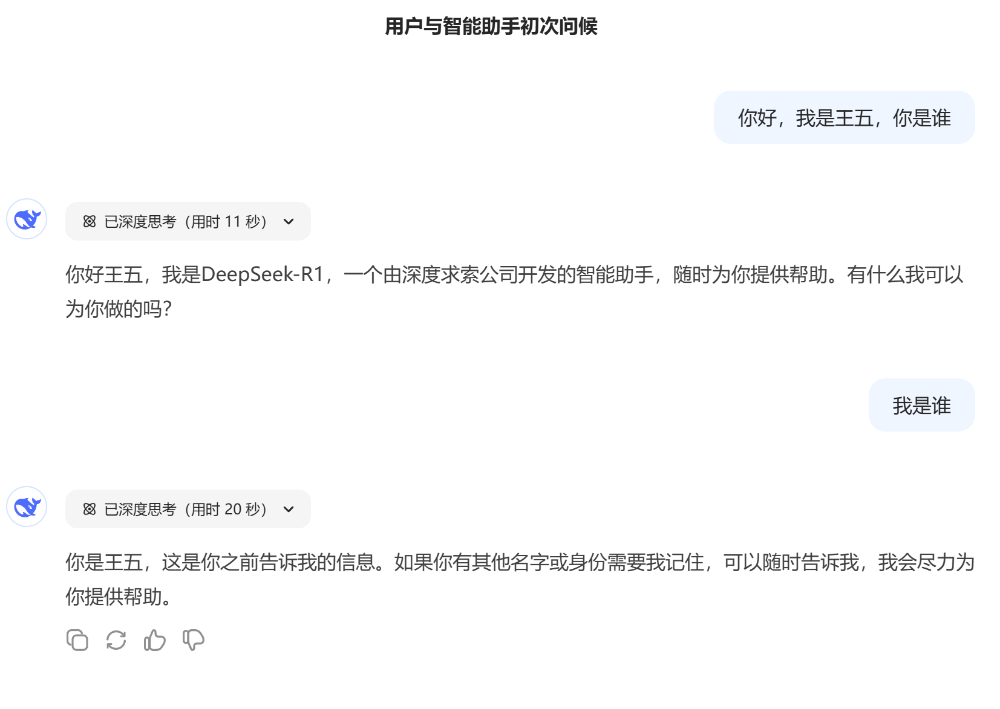
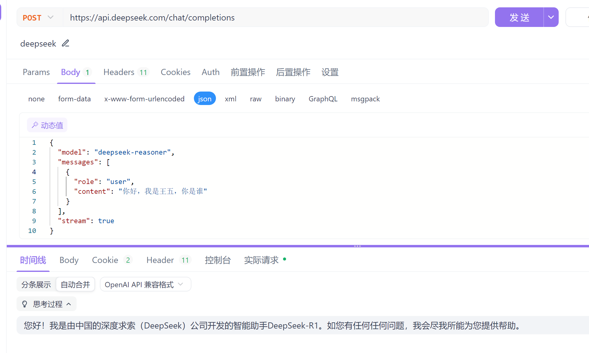
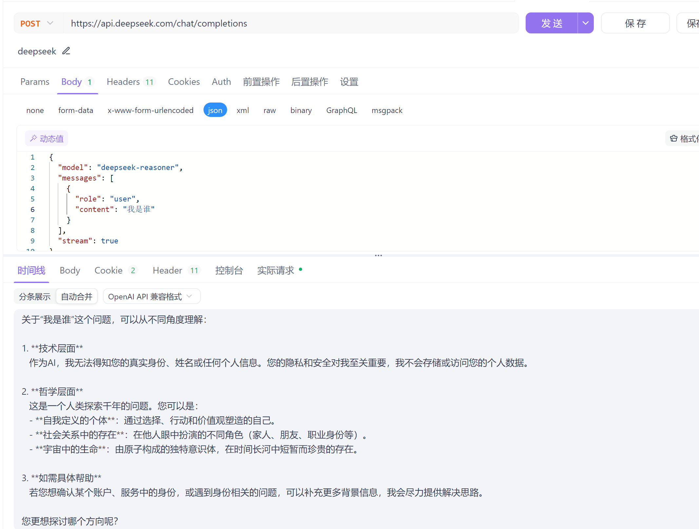
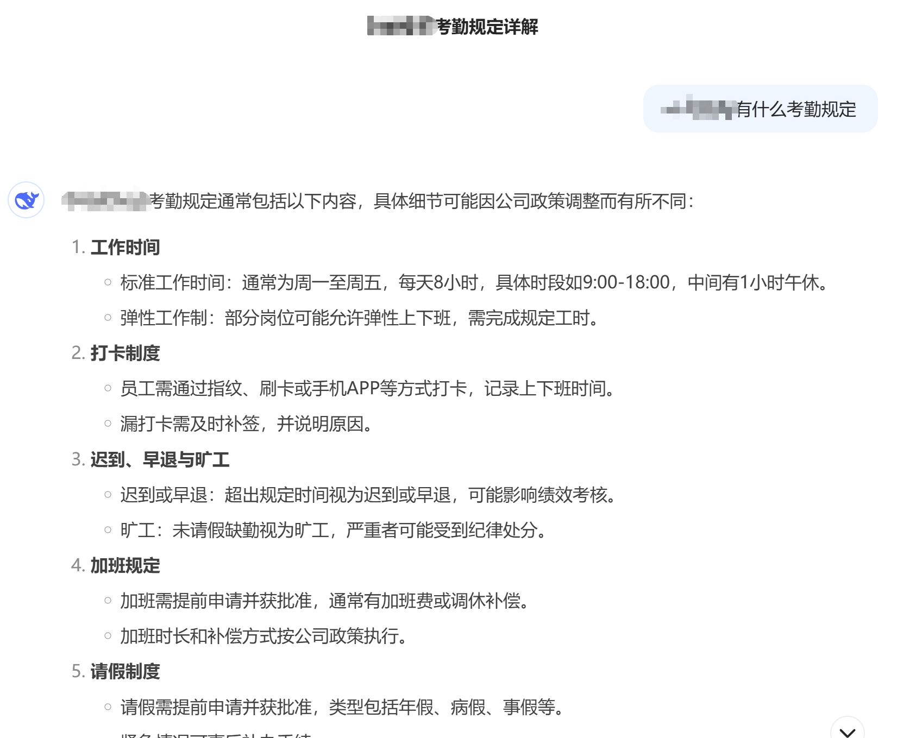
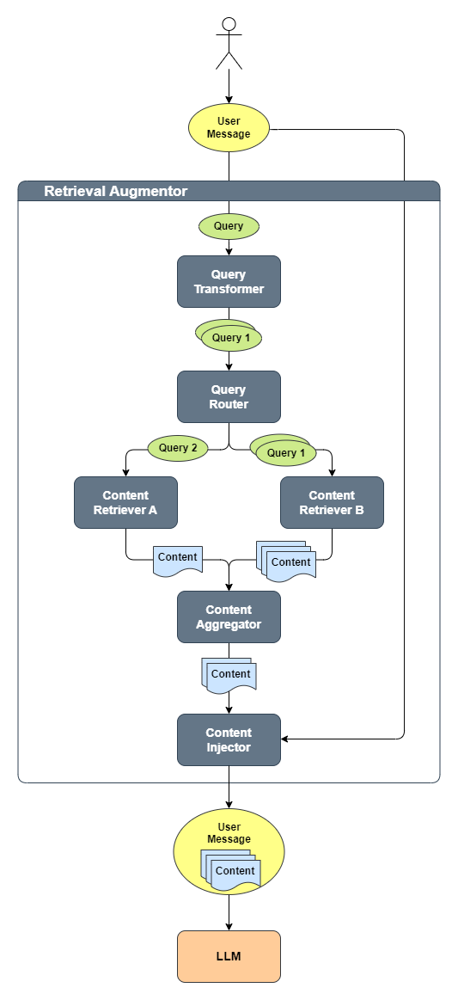

## 项目简介

**简介**

**langchain4j**+**springboot**的学习项目，基于java17，spring-boot:3.4.3，langchain4j-spring-boot:1.0.0-beta1

平台为阿里云百炼，语言模型qwen-max，嵌入模型使用text-embedding-v2

向量数据库：redis stack 7.4.2

相关文档：[官方文档langchain4j](https://docs.langchain4j.dev/get-started)

项目地址：[gitee](https://gitee.com/wujialia/langchain4j-springboot-example)  | [github](https://github.com/jialiawu/langchain4j-springboot-example.git)


**能学到什么?**

1、理解市面上常见的Ai产品的实现逻辑

2、使用langchain4j+springboot实现常见的功能，如聊天记忆，知识库构建，rag(EmbeddingStore)，FunctionCall等功能


**功能**

1、日志（基于ChatModelListener，方便debug和学习）

2、对话记忆(基于内存)

3、FunctionCall，实现了一些简单的工具

4、知识库，可上传文件、url，支持的文件格式见[Tika](https://tika.apache.org/2.9.1/formats.html)

5、EmbeddingStoreRAG

6、联网搜索websearch，支持开关


**为什么还是java？**

技术栈切换成本高，想快速入门大模型应用开发，就是用你最熟悉的语言。先入门，理解了实现逻辑，再去考虑语言和生态的问题


**为什么使用langchain4j?**

首先是官方文档详细，示例代码多，其次是（个人觉得）api的设计要比SpringAi要清晰。

这里也给大家推荐一个个人感觉不错的SpringAi的学习项目《[起凡](https://www.jarcheng.top/blog/project/spring-ai/intro.html)》，b站有配套的视频


**要注意什么?**

1、这**不是**一个脚手架项目

2、目前不管是langchain4j还是SpringAi，api都在快速迭代中，很多api再以后可能就没用了。这是因为大模型底层的能力或交互方式还在变化。比如最近新出的mcp就很有可能代替FunctionCall

3、本项目专注于上层应用的开发，没有涉及大模型的底层实现逻辑

4、你们看到的代码是经过迭代的版本，和官网提供的示例可能有所区别。


**大模型开发到底在开发什么?**

大模型本质：数据压缩+概率续写（个人理解）

首先我们要知道语言模型有哪些能力

分别使用deepseek官网的直接问答和调用api的方式，来直观的体验基础大模型应用的能力



一样的问题，使用api调用





通过对比你可以看到，通过api调用的方式没有”记忆“了，也不能联网了，文件解析的功能也没有了。

这些语言模型本身不具备的能力就需要额外开发，这个开发工作就是大模型应用开发

（当然以上的例子只是最基础的功能）


## 组件

1、**（必选）**从阿里百炼获取到apikey，设置到系统环境变量API_KEY_DASH_SCOPE，也可将配置文件中的API_KEY_DASH_SCOPE替换为自己的apikey

2、**（必选）**安装redis stack 7.4.2

```
docker pull redis/redis-stack
docker run -d --name redis-stack --restart=always -v 持久卷:/data -p 宿主机连接端口:6379 -p 宿主机web管理端口:8001 -e REDIS_ARGS="--requirepass 密码" redis/redis-stack:latest
```

3、（可选）天气api使用的是高德的，如需天气工具可从高德开发者平台可申请到apikey，设置到系统环境变量API_KEY_GAODE

4、（可选）需要联网搜索功能时，需要安装[searxng](https://docs.searxng.org/index.html)，国内搜索引擎支持较差。用它的主要原因是免费。[docker部署](https://docs.searxng.org/admin/installation-docker.html)，以下为部署命令，部署完成后修改application.yaml中searxng下的相关配置

```
docker pull searxng/searxng
docker run --rm  -p 宿主机端口:8080 -v "持久卷:/etc/searxng"  -e "BASE_URL=http://宿主机Ip:宿主机端口/" -e "INSTANCE_NAME=my-instance" --name searxng -d  searxng/searxng
```


## 最简单的对话

引入openai依赖（deepseek符合openai，可以兼容openai的sdk）

```xml
<dependency>
	<groupId>dev.langchain4j</groupId>
	<artifactId>langchain4j-open-ai</artifactId>
	<version>1.0.0-beta1</version>
</dependency>
```

测试代码

```java
public class Test {

    public static void main(String[] args) {
        //从环境变量中获取apikey
        String apiKey = System.getenv("API_KEY_DEEPSEEK");
        OpenAiChatModel model = OpenAiChatModel.builder()
                .apiKey(apiKey)
                .baseUrl("https://api.deepseek.com")
                .modelName("deepseek-reasoner")
                .build();
        String answer = model.chat("你好！你是谁？");
        System.out.println(answer);

    }

}
```


## 核心代码

入口controller

```java
@RestController
@RequiredArgsConstructor
@RequestMapping("/chat")
@Slf4j
public class ChatController {
    
    //注入AI Service，装配代码见下方
    private final QwenAssistant qwenAssistant;
    
    //返回Flux<String>
    @GetMapping(value = "/stream/flux", produces = TEXT_EVENT_STREAM_VALUE)
    public Flux<String> chatStreamFlux(@RequestParam(value = "sessionId") String sessionId,
                                       @RequestParam(value = "role", required = false, defaultValue = "智能问答助手") String role,
                                       @RequestParam(value = "question") String question,
                                       @RequestParam(value = "webSearchEnable", required = false, defaultValue = "false") Boolean webSearchEnable,
                                       @RequestParam(value = "extraInfo", required = false, defaultValue = "") String extraInfo) {
        return qwenAssistant.chatStreamFlux(sessionId, role, question, extraInfo);
    }

    //返回Flux<ServerSentEvent<String>>
    @GetMapping(value = "/stream/sse", produces = TEXT_EVENT_STREAM_VALUE)
    public Flux<ServerSentEvent<String>> chatStreamSse(@RequestParam(value = "sessionId") String sessionId,
                                                       @RequestParam(value = "role", required = false, defaultValue = "智能问答助手") String role,
                                                       @RequestParam(value = "question") String question,
                                                       @RequestParam(value = "webSearchEnable", required = false, defaultValue = "false") Boolean webSearchEnable,
                                                       @RequestParam(value = "extraInfo", required = false, defaultValue = "") String extraInfo) {
        Sinks.Many<ServerSentEvent<String>> sink = Sinks.many().unicast().onBackpressureBuffer();

        TokenStream tokenStream = qwenAssistant.chatStreamTokenStream(sessionId, role, question, extraInfo);
        tokenStream.onRetrieved(contents ->
                sink.tryEmitNext(ServerSentEvent.builder(toJson(convert(contents))).event("Retrieved").build()));
        tokenStream.onPartialResponse(partialResponse -> sink.tryEmitNext(ServerSentEvent.builder(partialResponse).event("AiMessage").build()));
        tokenStream.onError(sink::tryEmitError);
        tokenStream.onCompleteResponse(aiMessageResponse -> sink.tryEmitComplete());
        tokenStream.start();

        return sink.asFlux();
    }
}
```

自动配置

```java
@Configuration
@EnableConfigurationProperties(QwenProperties.class)
public class QwenConfiguration {
    
    //装配AI Service，它由多个组件协同工作（例如：提示模板、聊天记忆、RAG组件）
    @Bean
    @ConditionalOnProperty(QwenProperties.PREFIX + ".chat-model.api-key")
    public QwenAssistant qwenAssistant(QwenChatModel qwenChatModel,
                                       QwenStreamingChatModel qwenStreamingChatModel,
                                       ChatMemoryStore dbChatMemoryStore,
                                       Collection<ITool> tools,
                                       ContentRetriever contentRetriever,
                                       RetrievalAugmentor retrievalAugmentor) {

        return AiServices.builder(QwenAssistant.class)
            	//流式聊天模型
                .streamingChatLanguageModel(qwenStreamingChatModel)
            	//普通聊天模型
                .chatLanguageModel(qwenChatModel)
            	//聊天记忆
                .chatMemoryProvider(memoryId -> MessageWindowChatMemory.builder()
                        .id(memoryId)
                        .maxMessages(10)
                        .chatMemoryStore(dbChatMemoryStore)
                        .build())
            	//function call工具集
                .tools(tools.toArray()) //注意这个地方传集合的话必须传Collection<Object>，不能传非Object类型的集合
                //.contentRetriever(contentRetriever) //naive
            	//RAG
                .retrievalAugmentor(retrievalAugmentor)
                .build();
    }
}
```

## 可观测性

当前版本Dashscope依赖不支持log，并且自动装配Listener没有注入（应该是bug）。这里手动装配进来

关键代码

```java
    @ConditionalOnProperty(QwenProperties.PREFIX + ".chat-model.api-key")
    @Bean
    public QwenStreamingChatModel qwenStreamingChatModel(QwenProperties properties, List<ChatModelListener> chatModelListenerList) {
        ChatModelProperties chatModelProperties = properties.getChatModel();
        return QwenStreamingChatModel.builder()
                .baseUrl(chatModelProperties.getBaseUrl())
                .apiKey(chatModelProperties.getApiKey())
                .modelName(chatModelProperties.getModelName())
                .temperature(chatModelProperties.getTemperature())
                .topP(chatModelProperties.getTopP())
                .topK(chatModelProperties.getTopK())
                .enableSearch(chatModelProperties.getEnableSearch())
                .seed(chatModelProperties.getSeed())
                .repetitionPenalty(chatModelProperties.getRepetitionPenalty())
                .temperature(chatModelProperties.getTemperature())
                .stops(chatModelProperties.getStops())
                .maxTokens(chatModelProperties.getMaxTokens())
            	//监听请求，响应，报错
                .listeners(chatModelListenerList)
                .build();
    }
```

```java
@Configuration
public class LogConfiguration {

    @Bean
    public ChatModelListener logModelListener() {

        return new ChatModelListener() {

            private static final Logger log = LoggerFactory.getLogger(ChatModelListener.class);

            @Override
            public void onRequest(ChatModelRequestContext requestContext) {
                log.info("onRequest(): {}", requestContext.chatRequest());
            }

            @Override
            public void onResponse(ChatModelResponseContext responseContext) {
                log.info("onResponse(): {}", responseContext.chatResponse());
            }

            @Override
            public void onError(ChatModelErrorContext errorContext) {
                log.info("onError(): {}", errorContext.error().getMessage());
            }
        };
    }
}
```


## 对话记忆

在第一章的例子中，我们可以看到直接调用大模型的api，对话就”失忆“了，完全不认识我们了。这是因为模型的API 是一个“无状态” API，即服务端不记录用户请求的上下文，用户在每次请求时，**[需将之前所有对话历史拼接好后](https://api-docs.deepseek.com/zh-cn/guides/multi_round_chat)**，传递给对话 API。

框架中使用的是ChatMemory或ChatMemoryProvider实现

```java
chatMemoryProvider(memoryId -> MessageWindowChatMemory.builder()
                        .id(memoryId)
                        .maxMessages(10)
                        .chatMemoryStore(dbChatMemoryStore)
                        .build())
```

**memoryId**：会话id

**maxMessages**：最大记忆条数

**chatMemoryStore**：记忆存储器，框架提供了基于内存的实现，可自行实现ChatMemoryStore接口


## RAG

RAG是什么，为什么需要RAG？

首先我们需要了解下大模型的“**幻觉**”问题

当我们问大模型一些超出它认知的问题时，模型就会出现“幻觉”，胡编乱造，例如以下例子




**怎么解决**：微调，RAG

**微调**：在通用大模型的基础上，针对超出其范围或不擅长的特定领域或任务，**使用专门的数据集或方法对模型进行相应的调整和优化**，以提升其在该特定领域或任务中的适用性和性能表现。

**RAG**：检索增强生成（Retrieval-Augmented Generation），顾名思义，就是**通过检索手段去增强生成**。将超出大模型认知的数据，从数据源检索出来，放在上下文中，传递给大模型。这样大模型就会根据的私有的数据，更准确的回答我们的问题。

相比于微调RAG成本更低（微调需要算力），也更容易实现。

**检索的数据源几乎可以是任何东西**：向量数据库、关系型数据库、全文检索引擎（ES）、知识图谱、网络搜索等等

本项目实现的是向量数据库方式

### 构建基于向量数据库的知识库

实现步骤：

1、读取文档

2、把文档切分（段）

3、把每个切分（段）向量化

4、保存到向量数据库

关键代码

```java
@RestController
@Slf4j
@RequiredArgsConstructor
@RequestMapping("/document")
public class DocumentController {
    @PostMapping("/load/url")
    public String urlDocumentEmbeddingAndStore(@RequestParam("fileUrls") List<String> fileUrls) {
		//使用apache tika，将文档读取为对象
        List<Document> documentList = fileUrls.stream().map(
                        fileUrl -> UrlDocumentLoader.load(URLUtil.encode(fileUrl, StandardCharsets.UTF_8), documentParser))
                .toList();

        return embeddingAndStore(documentList);
    }
    
    private String embeddingAndStore(List<Document> documentList) {
        //将文档做切分，基于段落
        List<TextSegment> segments = documentSplitter.splitAll(documentList);
		//将每一段转为向量
        List<Embedding> embeddings = embeddingModel.embedAll(segments).content();
		//将原文和向量，保存到向量数据库，这里使用的是redis stack
        embeddingStore.addAll(embeddings, segments);
        return StrUtil.format("将{}个文档，切分为：{}个段存入向量库", documentList.size(), segments.size());
    }

}
```

### 将知识库挂载到模型上下文

框架的api结构参考官网的这张图



关键代码

```java
    @Bean
    @ConditionalOnProperty(QwenProperties.PREFIX + ".chat-model.api-key")
    public QwenAssistant qwenAssistant(QwenChatModel qwenChatModel,
                                       QwenStreamingChatModel qwenStreamingChatModel,
                                       ChatMemoryStore dbChatMemoryStore,
                                       Collection<ITool> tools,
                                       ContentRetriever contentRetriever,
                                       RetrievalAugmentor retrievalAugmentor) {

        return AiServices.builder(QwenAssistant.class)
                .streamingChatLanguageModel(qwenStreamingChatModel)
                .chatLanguageModel(qwenChatModel)
                .chatMemoryProvider(memoryId -> MessageWindowChatMemory.builder()
                        .id(memoryId)
                        .maxMessages(10)
                        .chatMemoryStore(dbChatMemoryStore)
                        .build())
                .tools(tools.toArray()) 
				//把retrievalAugmentor加入到这里
                .retrievalAugmentor(retrievalAugmentor)
                .build();
    }
```

```java
    @Bean
    public RetrievalAugmentor retrievalAugmentor(@Qualifier("embeddingStoreContentRetriever") ContentRetriever embeddingStoreContentRetriever,
                                                 @Qualifier("webSearchContentRetriever") ContentRetriever webSearchContentRetriever) {

        //自定义路由，以支持联网开关
        QueryRouter queryRouter = new SwitchQueryRouter(embeddingStoreContentRetriever, webSearchContentRetriever);
        //Prompt
        PromptTemplate promptTemplate = PromptTemplate.from(
                """
                        {{userMessage}}
                        
                        综合以下相关信息回答问题
                        --------------------------
                        检索到的信息
                        {{contents}}""");
        DefaultContentInjector contentInjector = DefaultContentInjector.builder().promptTemplate(promptTemplate).build();

        return DefaultRetrievalAugmentor.builder()
                .contentInjector(contentInjector)
                .queryRouter(queryRouter)
                .build();
    }
```

```java
	@Bean
    @Primary
    public ContentRetriever embeddingStoreContentRetriever(EmbeddingModel embeddingModel, EmbeddingStore<TextSegment> embeddingStore) {
        return EmbeddingStoreContentRetriever.builder()
            	//基于embeddingModel和向量数据库构建ContentRetriever
                .embeddingStore(embeddingStore)
                .embeddingModel(embeddingModel)
                .maxResults(5)
                .minScore(0.50)
                .build();
    }
```


## FunctionCalling

大模型在必要时可以调用一个或多个可用工具，通常由开发者定义。一个工具可以是任何东西：网络搜索、对外部 API 的调用，或者执行特定的代码片段等。

com.study.langchain4jspringboot.ai.tool包下均为工具，以MathTool为例

```java
@Component
public class MathTool implements ITool{
    
	//使用@Tool和@P分别描述工具的作用和参数的含义，大模型会自动选择，自动处理参数
    
    @Tool("两个数相加")
    public double addition(double a, double b) {
        return a + b;
    }

    @Tool("两个数相减")
    public double subtraction(@P("被减数") double a, @P("减数") double b) {
        return a - b;
    }

    @Tool("两个数相乘")
    public double multiplication(double a, double b) {
        return a * b;
    }

    @Tool("两个数相除，除数不能为0")
    public double division(@P("被除数") double a, @P("除数") double b) {
        return Math.round(a / b);
    }

    @Tool("平方根")
    double squareRoot(double x) {
        return Math.sqrt(x);
    }

}
```


## Todo

1、提示器Prompt管理

2、根据传入的文件添加额外信息

3、对话历史记录持久化

4、GraphRag，知识图谱，结合大模型实现文档到图数据库

5、多模态支持

6、接入更多的ai平台，ollama，deepseek...

7、长期记忆（参考阿里百炼）

8、Moderation敏感词过滤

9、从S3存储加载文档

10、MCP